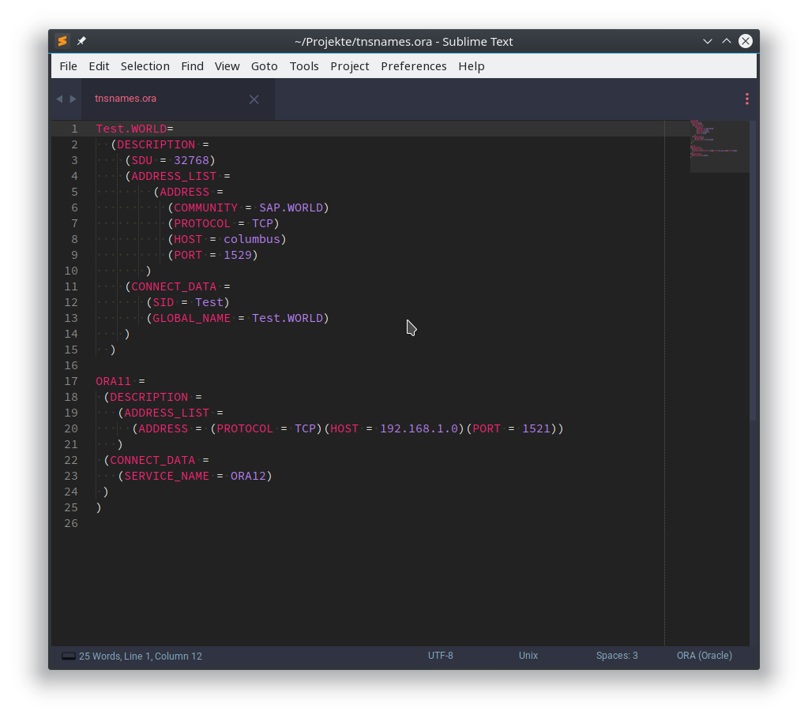

# sublime-ora

Package for sublime syntax highlighting the .ora files from Oracle.

For example, the tnsnames.ora or the sqlnet.ora of an orace database show in some better way than without highlighting.

## Screenshots

## Installation

Installation through package control is recommended. It will handle updating your packages as they become available.

To install, do the following.

* In the Command Palette, enter Package Control: Install Package
* Search for Oracle_ORA

## License

**Copyright 2019 by MicMun**

This program is free software: you can redistribute it and/or modify it under the terms of the GNU General Public License as published by the Free Software Foundation, either version 3 of the License, or (at your option) any later version. This program is distributed in the hope that it will be useful, but WITHOUT ANY WARRANTY; without even the implied warranty of MERCHANTABILITY or FITNESS FOR A PARTICULAR PURPOSE. See the GNU General Public License for more details. You should have received a copy of the GNU General Public License along with this program. If not, see http://www.gnu.org/licenses/.
